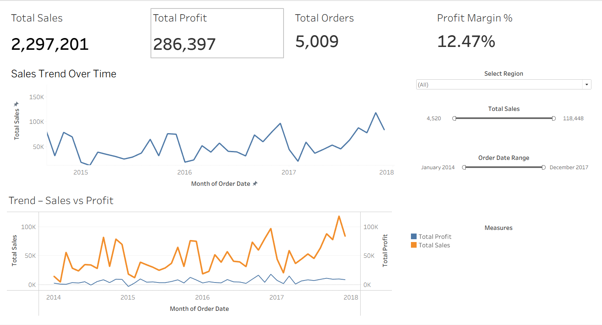
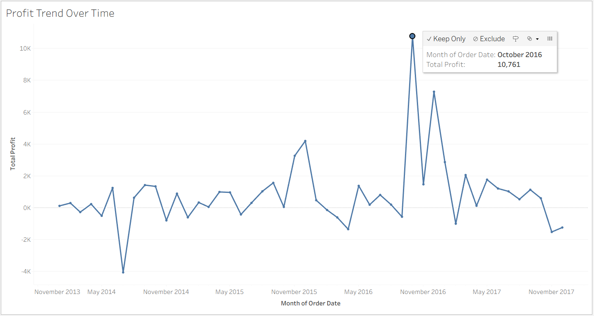
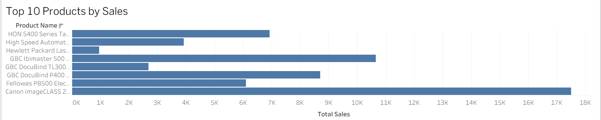

# Retail Sales Analytics Dashboard

Interactive BI dashboard built with **Tableau** to analyze retail sales performance, profitability trends, and product-level insights.

The goal of this project is to answer practical business questions such as:
- Which products generate high revenue but low profit?
- Where are the category-level performance gaps?
- How do sales and profitability change across regions and time?

---

## Project Overview

- Performed KPI analysis for revenue, profit, margin, and sales trends
- Identified **high-revenue, low-profit** products impacting overall margins
- Enabled region-wise and time-based exploration using interactive filters
- Compared category performance to highlight growth and optimization opportunities

---

## Tools & Skills Used

- **Tableau** – interactive dashboards, filters, time-series analysis
- **Excel / SQL / Python** – data cleaning, transformation, and validation
- KPI design and business-oriented data storytelling

---

## Dashboard Preview

### Sales Overview


### Profitability Analysis


### Top Products & Categories


> Screenshots are taken from the interactive Tableau dashboard.

---

## Data

- Dataset: Public retail dataset (e.g. Superstore-style data)
- Data includes sales, profit, product categories, regions, and order dates
- Minor cleaning and transformation were performed before dashboard creation

If the full dataset cannot be shared, this repository focuses on the dashboard logic and insights.

---

## Repository Structure

```text
retail-sales-analytics-dashboard/
│
├── tableau/        # Tableau workbook (.twb / .twbx)
├── data/           # Dataset or sample data
├── assets/         # Dashboard screenshots
├── docs/           # Notes and insights
└── README.md
